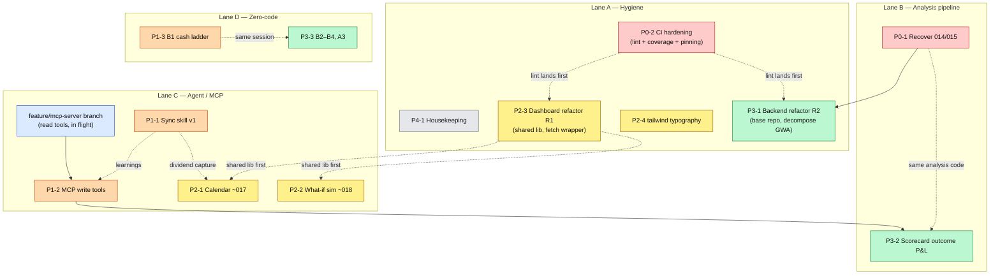

# Roadmap — July 2026 review

Full project review performed 2026-07-21: feature inventory (specs 001–016), code-health survey, CI audit, and a re-evaluation of the standing analysis-improvement backlog. Focus areas chosen by the owner: **position-sync automation, dividend & maturity calendar, what-if simulation, refactors, CI**.

The single most important finding is not a new feature at all: **two merged features never reached `main`** (see P0-1). Second, the IOL/IBKR MCP connectors are now reachable from Claude Code sessions, which unlocks the long-desired automated position sync as a skill rather than a manual Desktop ritual.

## Priority table

| # | Item | Effort | Value | Vehicle |
|---|------|--------|-------|---------|
| P0-1 | Recover lost features 014 + 015 | S–M | High (believed shipped, aren't) | ad-hoc PR |
| P0-2 | CI hardening (lint, coverage floor, pinning) | M | High (protects all later work) | ad-hoc PR(s) |
| P1-1 | Position sync agent, v1 skill | M | High (kills the most painful manual chore) | repo skill + doc |
| P1-2 | MCP write tools (sync v2) | M | Medium-High | speckit spec |
| P1-3 | Backlog B1: off-system-cash ladder rule | XS | High per effort | instructions edit (no code) |
| P2-1 | Dividend & maturity calendar | M | Medium-High | speckit spec (~017) |
| P2-2 | What-if simulation | M | Medium | speckit spec (~018) |
| P2-3 | Dashboard refactor round 1 | S–M | Medium | ad-hoc PR |
| P2-4 | `@tailwindcss/typography` (backlog option A) | XS | Medium per effort | ad-hoc PR |
| P3-1 | Backend refactor round 2 | M–L | Medium | ad-hoc PRs |
| P3-2 | Scorecard outcome P&L | M | Medium | speckit spec |
| P3-3 | Backlog A3, B2–B4 | XS–S | Low-Medium | mostly instructions edits |
| P4-1 | Housekeeping | S | Low | ad-hoc PR |

Backlog item **A6 (feed prior-order execution status into the prompt) is already shipped** — `GenerateWeeklyAnalysis._loadPreviousAnalysis` includes `executionStatus` per prior order (feature 007, FR-009). Struck from the backlog.

---

## P0-1 — Recover lost features 014 & 015

**Evidence.** PRs #29 (`feat(014): cross-broker duplicate-holdings detector`) and #30 (`feat(015): analysis token-diet v2`) show **MERGED** on GitHub (2026-06-22), but they were stacked PRs merged into their *base feature branches*, not `main`:

- `00f0d5e` (#29) exists only on `origin/013-administrative-positions`
- `87413ab` (#30) exists only on `origin/014-duplicate-holdings-detector`
- `origin/main` history jumps #28 → #31; `DuplicateHoldingsDetector` is absent from `src/domain/services/`

Token-diet **v1** (feature 011, PR #26) *is* in main; **v2** is not. The duplicate-holdings detector is entirely missing from production.

**Recovery.** Branch off current `main`, merge (or cherry-pick `df9b19b` + `87413ab` from) `origin/014-duplicate-holdings-detector`, resolve conflicts with #31 (charts polish) and #32 (responsive dashboard), re-run the full test suite, open a normal PR to `main`. Also restore the `specs/014-*` and `specs/015-*` directories that ride along on that branch.

**Process guard.** When merging stacked PRs, merge bottom-up and confirm GitHub retargets each PR's base to `main` after the one below merges (GitHub retargets on *branch deletion*, not on merge). Add "verify base branch before merging" to the PR routine.

## P0-2 — CI hardening

Current state: `pr-checks.yml` runs backend tests + a dashboard build. Deploy workflows exist. Gaps, in order of value:

1. **No linter exists** — no ESLint or Prettier config anywhere. Add ESLint flat config (backend + dashboard, incl. `eslint-plugin-astro`) + Prettier, plus a `lint` job in `pr-checks.yml`.
2. **Coverage gate is disabled** — `jest.config.js` thresholds are all 0, `npm test` uses `--passWithNoTests`, and `src/functions/**` is excluded from coverage. Set a realistic floor (start at current actuals, ratchet up), include `src/functions/**`, drop `--passWithNoTests` from the main script.
3. **Unpinned git dependency** — dashboard depends on `@amajail/ui#master` (floating) and the dashboard deploy uses `npm install`, not `npm ci`. Pin to a tag/commit; switch deploy to `npm ci`.
4. **`engines.node >=18` is stale** — everything (workflows, Azure runtime) runs Node 22. Set `engines.node: ">=22"`.
5. **No dashboard tests** — lowest priority of the five; if added, start with a couple of Playwright smoke tests (nav renders, each page loads without console errors) reusing the existing local Playwright setup.

## P1-1 — Position sync agent, v1 (repo skill)

**Unblocked:** the IOL and IBKR MCP connectors (`mcp__claude_ai_Invertir_Online__*`, `mcp__claude_ai_Interactive_Brokers_IBKR__*`) are now available **inside Claude Code sessions** — the old workflow's "pull in Claude Desktop, paste JSON back" step is obsolete.

Build a repo skill (`.claude/skills/sync-positions/SKILL.md`) encoding the proven workflow:

1. Pull live holdings: IOL `get_portfolio`, IBKR `get_account_positions` (+ balances for cash rows).
2. Diff against the **live store**, never `scripts/positions.json`: start `func start` (reads `local.settings.json` → the real cloud store), `GET /api/positions?broker={iol|ibkr}`.
3. Apply the hard-won data rules:
   - IOL exposes no cost basis → PUT `quantity` only, **preserve existing `averageCost`**.
   - IBKR exposes real cost basis → safe to overwrite.
   - Fixed income (bond/bopreal/on/lecap): store is per-100-nominales on the *app-price scale*; the IOL connector's scale differs per instrument — rescale each row against its own live app price, never blanket-multiply.
   - `averageCost` is required on create (use 1 for cash); currencies outside the Money whitelist (e.g. CAD) → store as USD.
4. Emit a gitignored `scripts/update-<date>.local.js` with `--dry-run`, show the diff, apply only on user confirmation, verify via GET, stop the host.
5. Refresh `scripts/positions.json` so the canonical snapshot stays in sync.

## P1-2 — MCP write tools (sync v2)

Extend `src/functions/mcp.js` beyond read-only so an agent can close the loop conversationally:

- `update_position` (partial PUT semantics, same validation path as HTTP)
- `create_position`
- `set_order_execution_status` (feeds the scorecard without opening the dashboard)
- optionally `trigger_price_refresh`

Reuse the existing DI use-cases exactly as the read tools do. Keep destructive ops (delete) off MCP. This deserves a speckit spec: auth posture, guardrails (e.g. reject quantity changes above a % threshold without confirmation), and audit logging are real design questions.

**v3 (later, optional):** scheduled sync run. Caveat: interactively-authenticated connectors may be absent in headless/cron contexts, so keep a human-in-the-loop apply step regardless.

## P1-3 — Backlog B1: off-system-cash deployment ladder

The weekly analysis has flagged the same off-system-cash imbalance repeatedly with no standing instruction on how to deploy it. A pure **instructions-document edit** (feature 004/005 editor, no code): add a laddered deployment rule so the model makes concrete, trackable suggestions instead of re-flagging. Highest leverage per unit of effort in the whole backlog.

## P2-1 — Dividend & maturity calendar (~spec 017)

- **Maturities:** `maturityDate` already exists on Position for bond/lecap/on/bopreal rows — a calendar of upcoming maturities is a pure read. Near-zero data risk.
- **Dividends:** need a source. Options: `yahoo-finance2` calendar/dividend events (already a dependency, used by RefreshPrices) for US-listed holdings; IOL `get_next_corporate_events` connector data captured at sync time for local instruments.
- Shape: one `GET /api/calendar` endpoint (upcoming events, ordered), one dashboard page, optional `get_calendar` MCP tool. Could also feed the weekly analysis context ("BOND-X matures in 12 days — reinvestment suggestion?") — that tie-in is the differentiating value.

## P2-2 — What-if simulation (~spec 018)

Input a hypothetical order list → recompute allocation drift, concentration caps, and portfolio totals **reusing the existing domain services** (`AllocationDriftCalculator`, `PortfolioCalculator`, and the cap logic used by the weekly analysis). Stateless `POST /api/analysis/simulate` + a dashboard page; no persistence in v1. Natural companion to the analysis-detail page ("what does the portfolio look like if I execute these suggested orders?") — consider a "simulate these orders" button there as the entry point.

## P2-3 — Dashboard refactor round 1

- Extract the 3 duplicated `escapeHtml` copies and per-page `fmt` helpers into `dashboard/src/lib/format.js` (already the natural home).
- Add a shared load-or-render-error fetch wrapper (every page hand-rolls try/catch + error-banner `innerHTML`; `positions.astro` has 5 copies, `instructions.astro` 6).
- Decompose `analysis-detail.astro` (616 lines, ~12 inline `innerHTML` render blocks) into per-section render modules under `lib/`.

## P2-4 — `@tailwindcss/typography` (backlog structured-display option A)

Still absent: the `prose` class on analysis markdown is inert, so GFM tables the model emits render unstyled. One-dependency PR, immediate readability win on `analysis-detail`. (Option B — structured fields — shipped as feature 010; this is the cheap complement that was deferred.)

## P3-1 — Backend refactor round 2

- **Base Azure repository**: 7 `Azure*Repository` classes (~1,500 lines) each re-instantiate the table client and hand-roll entity↔record mapping. Extract a base class (client init, common CRUD, mapping hooks).
- **Decompose `GenerateWeeklyAnalysis.js`** (632 lines): split context assembly (macro, holdings, previous analysis), prompt building, and persistence into collaborators.
- **Timer error parity**: `refreshPricesTimer` / `weeklyAnalysisTimer` bypass the shared `mapError` path — add a shared timer error helper.
- **`container.js`** (536 lines) grows with every feature; consider per-module registration functions.

## P3-2 — Scorecard outcome P&L (deferred from 007)

Extend the scorecard from execution *rate* to execution *outcome*: for executed orders, compare suggestion price vs later prices to estimate realized/foregone P&L per suggestion and per conviction tier. Depends on capturing execution prices — pairs naturally with sync v2 (`set_order_execution_status` could accept an optional fill price).

## P3-3 — Remaining backlog (A3, B2–B4, C)

- **A3** plausibility guard on extreme macro readings — low value (the one scare was a real value, not a bug); keep as a cheap sanity-log if touched anyway.
- **B2** legacy/stub-holding policy, **B3** secondary profit-take trigger, **B4** soft-cap escalation after N weeks — all instructions-document edits; batch them with B1 in one editing session.
- **C** portfolio actions (pending orders, duplications, cleanup) — operational, not code; partially superseded by the 2026-07 syncs. Revisit after 014 lands (the duplicate detector will surface these automatically).

## P4-1 — Housekeeping

*(Done 2026-07-21 on `chore/housekeeping`.)* Verification during execution corrected the original survey: `metaprompt-rebalance-plan.md`, `logs/`, and the dated `update-*` scripts were **never tracked by git** — local-only and already gitignored — so no action or history concern. What actually changed:

- Removed `feature-weekly-context-capture.md` (content verified fully covered by specs 006/007/008/009).
- Removed stale zip excludes (`NEXT_STEPS.md`, `PROJECT_STATUS.md`) from `deploy-azure-function.yml`.
- Removed `tests/unit/.gitkeep`.

---

## Parallel execution plan

Most of the roadmap is *not* sequential. The items fall into four nearly independent lanes that only touch each other at a few hard dependency points:

- **Lane A — Hygiene** (CI, refactors, housekeeping). `P0-2` must merge **first overall**: introducing ESLint/Prettier reformats broadly, and every other open branch rebases on it once. The dashboard refactor waits for lint; the backend refactor waits for the 014/015 recovery (both rewrite `GenerateWeeklyAnalysis.js` — doing them in the other order guarantees painful conflicts).
- **Lane B — Analysis pipeline** (recovery, scorecard P&L). `P0-1` is self-contained and can start immediately, in parallel with everything.
- **Lane C — Agent / MCP** (sync skill, write tools, calendar). The sync skill `P1-1` has zero code dependencies — it can be built today. Write tools `P1-2` need the in-flight `feature/mcp-server` branch merged to main first. The calendar's dividend capture rides on the sync flow, so its implementation follows `P1-1` (the spec can be written anytime).
- **Lane D — Zero-code** (instructions edits B1, B2–B4, A3). One editing session, no dependencies, do whenever.

Hard dependencies (solid arrows) block; soft ones (dashed) are conflict-avoidance orderings that save rebase pain but can be violated if a lane stalls.

### Waves — what can run concurrently

| Wave | Items startable in parallel | Notes |
|------|-----------------------------|-------|
| **1 (today)** | P0-1 recovery · P0-2 CI · P1-1 sync skill · P1-3 + P3-3 instruction edits · P2-4 typography · P4-1 housekeeping · merge `feature/mcp-server` · specs for 017/018 | Seven independent workstreams; nothing blocks anything else. Merge order within the wave: **P0-2 first**, then the rest rebase once. |
| **2** | P2-3 dashboard refactor (after CI) · P1-2 MCP write tools (after mcp-server merges) · P2-1 calendar implementation (after sync skill) | |
| **3** | P3-1 backend refactor (after recovery) · P2-2 what-if implementation (after dashboard shared lib) · P3-2 scorecard P&L (after write tools) | |

Practical concurrency limit: wave 1 is bigger than one person's attention, but most items are S/XS — the natural batch is *(a)* P0-2 + P4-1 as one hygiene PR-pair, *(b)* P0-1 as its own PR, *(c)* P1-1 + instruction edits in one working session, *(d)* P2-4 as a drive-by PR. Parallel Claude sessions/worktrees map cleanly onto the lanes since they touch disjoint files.
